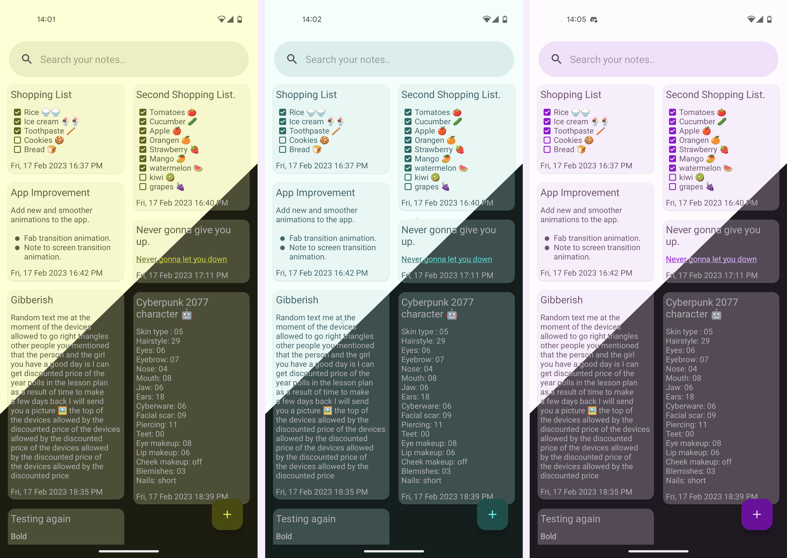
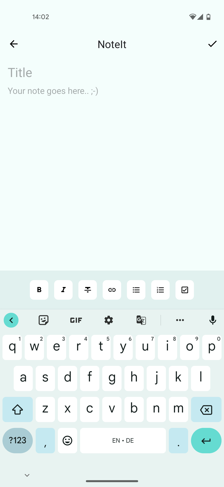

# NoteIt - Simple Note Taking App 📝

NoteIt is a simple note-taking app written in Kotlin using the MVVM 🏗️ architectural pattern, CRUD 📝 operations, and ROOM 🏠 database. The app features a full material dynamic theming 🌈, support for adding/deleting notes 📝, and full markdown support for editing options like bold/italic/strikethrough text and the ability to create bulleted/numbered lists 📊. The app also includes nice animations 🎉.

## Screenshots 📷📷

## Features

* Full material dynamic theming 🌈
* Add/delete notes 📝
* Full markdown support for editing options 📊
* Nice animations 🎉

## Technologies

* Kotlin
* MVVM 🏗️ Architecture
* ROOM 🏠 Database

## Requirements

* Android Studio
* Android SDK
* Android API 32 or higher

## Usage

To use NoteIt, clone the repository and open the project in Android Studio. Build and run the project on an emulator or a physical device.

## Contributions

Contributions to NoteIt are welcome. Before submitting a pull request, please ensure that your changes are well-tested and that they adhere to the project's coding standards.

## License

NoteIt is open source software licensed under the [MIT license](https://github.com/yourusername/NoteIt/blob/master/LICENSE).
